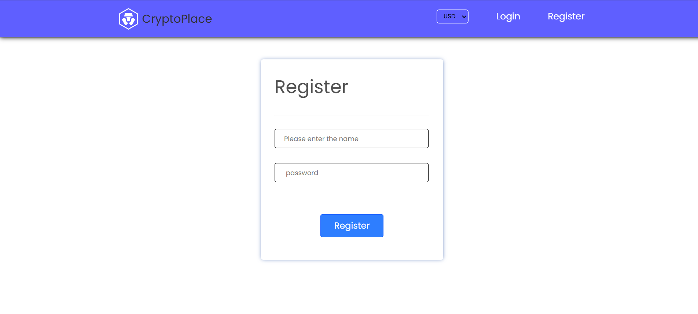
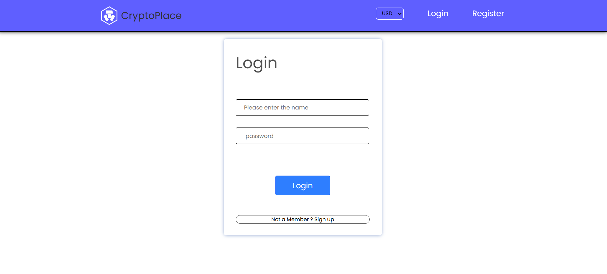
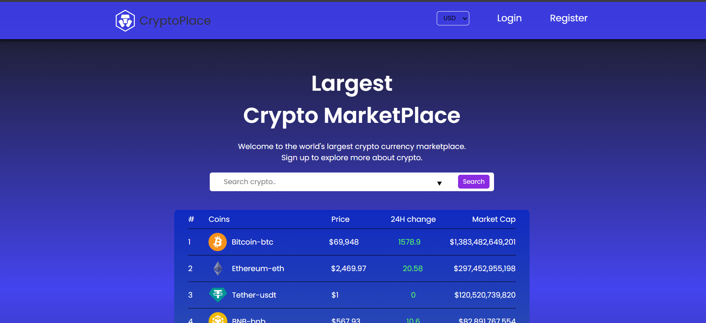
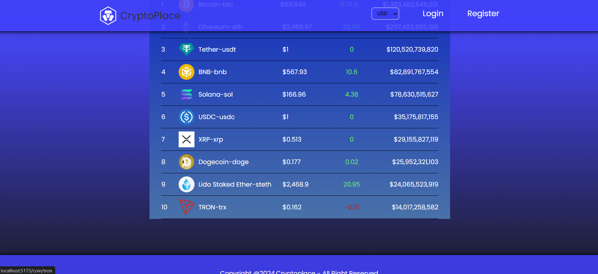

# 📈 Cryptocurrency

Welcome to the Cryptocurrency  project! This app gives users a powerful yet simple tool to track real-time cryptocurrency prices, historical trends, and market statistics with data provided by the [CoinGecko API](https://www.coingecko.com/en/api).

## 🌟 Overview

Cryptocurrency Tracker is designed to bring essential market data to both casual investors and crypto enthusiasts alike. With live price updates, trend indicators, and currency conversion, users can stay informed and make better financial decisions.









## ✨ Key Features

- **Live Market Data**: Track the latest prices, market caps, and trading volumes of popular cryptocurrencies.
- **Trending Coins**: Discover which coins are trending based on real-time CoinGecko data.
- **Currency Conversion**: Easily convert between cryptocurrencies and fiat currencies.
- **Historical Price Charts**: View price trends over custom timeframes to analyze past performance.
- **Search & Filter**: Quickly find specific cryptocurrencies or explore new ones.


## Languages and Libraries

### 1. **JavaScript**

- **Description**: JavaScript is the main programming language for this project, powering both the core functionality and interaction in the app.
- **Usage**:
  - **Frontend Logic**: Manages user interactions, data fetching, and updating the UI in response to user actions.
  - **API Requests**: Uses  `axios` to interact with the CoinGecko API and retrieve data.
  - **Component Logic**: Defines the logic and structure within each React component.

### 2. **React.js**

- **Description**: React.js is a powerful JavaScript library for building user interfaces, especially useful for single-page applications (SPAs).
- **Usage**:
  - **Component-Based Architecture**: React allows the application to be broken down into reusable components like `CoinList`, `CoinDetail`, and `Navbar`.
  - **State Management**: Manages application state (like coin data and user input) efficiently, enabling real-time updates and seamless user interactions.
  - **React Hooks**: Uses hooks such as `useState` and `useEffect`  and `useNavigate` to manage component state and side effects.

### 3. **CSS**

- **Description**: CSS is used for styling and laying out the application’s frontend elements.
- **Usage**:
  - **Custom Styling**: Adds custom styles for components, layouts, buttons, and other UI elements.
  - **Responsive Design**: Ensures that the app works well on various screen sizes, including mobile and desktop.
  - **CSS Libraries** : Libraries like Material-UI  used for a consistent design and responsive layout structure
 ### 4. **Node.js**

- **Description**: Node.js is a server-side runtime environment that allows JavaScript to be used on the backend. It enables handling requests, managing server-side logic, and serving the frontend code.
- **Usage**:
  - **Backend Server**: Acts as the server for the application, listening for client requests.
  - **API Requests**: Handles data requests to the CoinGecko API and serves responses to the frontend.
  - **Package Management**: Uses npm (Node Package Manager) for installing libraries and dependencies, such as Express and dotenv.

### 5. **Express.js**

- **Description**: Express.js is a lightweight Node.js framework used for creating server-side applications. It simplifies routing and request handling.
- **Usage**:
  - **RESTful API**: Defines routes that handle requests from the frontend to fetch cryptocurrency data.
  - **Middleware**: Manages request/response logging, error handling, and environmental configurations.
  - **Server Setup**: Easily sets up the backend server and defines endpoints for retrieving cryptocurrency data.

### 6. **CoinGecko API**

- **Description**: CoinGecko provides a free, reliable API for real-time cryptocurrency data. This API is essential for fetching the dynamic data that powers the application.
- **Usage**:
  - **Data Fetching**: Retrieves current market prices, trending coins, and historical data for various cryptocurrencies.
  - **Endpoints Used**:
    - `/coins/markets`: For general coin market data.
    - `/coins/{id}`: For details of a specific coin.
    - `/search/trending`: For trending coin data.

## Supporting Libraries and Tools


### 7. **dotenv**

- **Description**: dotenv is used to load environment variables from a `.env` file into `process.env`.
- **Usage**:
  - **Environment Configuration**: Manages sensitive data, such as the API base URL, in a secure and configurable manner.


### Installation

1. **Clone the repository**:
   ```bash
   https://crypto-currency-6220.onrender.com
