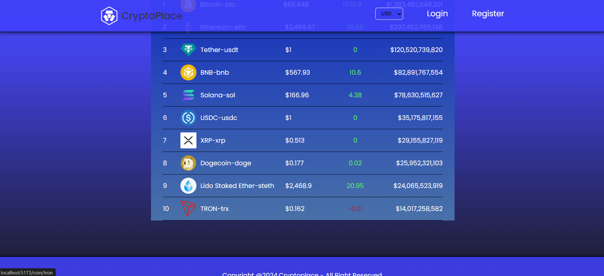

# 📈 Cryptocurrency Tracker

Welcome to the Cryptocurrency Tracker project! This app gives users a powerful yet simple tool to track real-time cryptocurrency prices, historical trends, and market statistics with data provided by the [CoinGecko API](https://www.coingecko.com/en/api).

## 🌟 Overview

Cryptocurrency Tracker is designed to bring essential market data to both casual investors and crypto enthusiasts alike. With live price updates, trend indicators, and currency conversion, users can stay informed and make better financial decisions.



## ✨ Key Features

- **Live Market Data**: Track the latest prices, market caps, and trading volumes of popular cryptocurrencies.
- **Trending Coins**: Discover which coins are trending based on real-time CoinGecko data.
- **Currency Conversion**: Easily convert between cryptocurrencies and fiat currencies.
- **Historical Price Charts**: View price trends over custom timeframes to analyze past performance.
- **Search & Filter**: Quickly find specific cryptocurrencies or explore new ones.

## 🚀 Quick Start Guide

### Requirements

- Node.js v14+ and NPM or Yarn.

### Installation

1. **Clone the repository**:
   ```bash
   git clone https://github.com/YourUsername/crypto-tracker.git
   cd crypto-tracker
